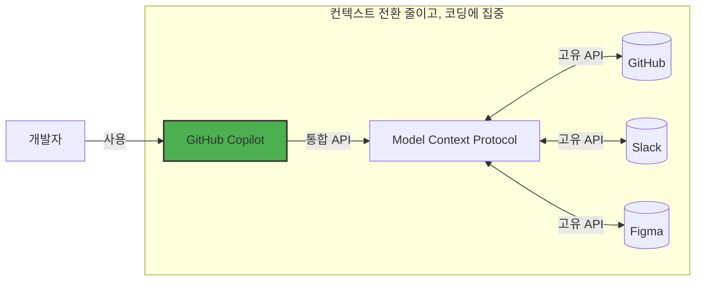

## Step 1: MCP 소개 및 환경 설정


[GitHub Copilot 시작하기](https://github.com/skills-kr/getting-started-with-github-copilot) 실습에서 학생들이 이벤트에 등록할 수 있는 Mergington 고등학교의 과외 활동 웹사이트를 소개받았습니다.

그런데 이제 문제가 생겼습니다... 하지만 좋은 문제입니다! 더 많은 선생님들이 이 사이트를 사용하고 싶어합니다! 🎉

동료 선생님들은 아이디어가 넘치지만 모든 요청을 처리하기가 벅찹니다! 😮 이 문제를 해결하기 위해, Model Context Protocol (MCP)을 활성화하여 GitHub Copilot을 업그레이드해 봅시다. 구체적으로, GitHub MCP 서버를 추가하여 이슈 관리와 웹사이트 업그레이드를 결합한 워크플로우를 만들겠습니다. 🧑‍🚀

시작해 봅시다!

### 📖 이론: Model Context Protocol (MCP)이란?

[Model Context Protocol (MCP)](https://modelcontextprotocol.io/introduction)은 흔히 "AI를 위한 USB-C"라고 불립니다 - GitHub Copilot(및 기타 AI 도구)이 다른 서비스와 원활하게 상호작용할 수 있게 하는 범용 커넥터입니다.

본질적으로, 서비스의 기능과 요구 사항을 설명하는 방법으로, AI 도구가 어떤 메서드를 사용할지 쉽게 결정하고 매개변수를 정확하게 제공할 수 있습니다. MCP 서버가 그 인터페이스를 제공합니다.



### :keyboard: 활동: 개발 환경 알아보기

MCP에 들어가기 전에, 개발 환경을 시작하고 과외 활동 애플리케이션을 다시 살펴봅시다.

1. 아래 버튼을 우클릭하여 새 탭에서 **Create Codespace** 페이지를 엽니다. 기본 구성을 사용하세요.

   [](https://codespaces.new/{{full_repo_name}}?quickstart=1)

1. **Copilot Chat** 및 **Python** 확장이 설치되고 활성화되어 있는지 확인합니다.

   <br/>
   

1. 수정 전에 애플리케이션이 실행되는지 확인합니다. 왼쪽 사이드바에서 **Run and Debug** 탭을 선택한 후 **Start Debugging** 아이콘을 누릅니다.

   <details>
   <summary>📸 스크린샷 보기</summary><br/>

   

   </details>

   <details>
   <summary>🤷 문제가 있나요?</summary><br/>

   **Run and Debug** 영역이 비어있다면, VS Code를 다시 로드해 보세요: 명령 팔레트(`Ctrl`+`Shift`+`P`)를 열고 `Developer: Reload Window`를 검색합니다.

   

   </details>

1. **Ports** 탭에서 웹페이지 주소를 찾아 열고, 실행 중인지 확인합니다.

   <details>
   <summary>📸 스크린샷 보기</summary><br/>

   

   

   </details>

### :keyboard: 활동: GitHub MCP 서버 추가하기

1. Codespace 안에서 **Copilot Chat** 패널을 열고 **Agent** 모드가 선택되어 있는지 확인합니다.

   

   <details>
   <summary>에이전트 모드가 없나요?</summary><br/>

   - VS Code가 최소 `v1.99.0`인지 확인합니다.
   - Copilot 확장이 최소 `v1.296.0`인지 확인합니다.
   - [사용자 또는 워크스페이스 설정](https://code.visualstudio.com/docs/configure/settings#_workspace-settings)에서 에이전트 모드가 활성화되어 있는지 확인합니다.

      

   </details>

1. Codespace 안에서 `.vscode` 폴더로 이동하여 `mcp.json`이라는 새 파일을 만듭니다. 다음 내용을 붙여넣으세요:

   📄 **.vscode/mcp.json**

   ```json
   {
     "servers": {
       "github": {
         "type": "http",
         "url": "https://api.githubcopilot.com/mcp/"
       }
     }
   }
   ```

1. `.vscode/mcp.json` 파일에서 **Start** 버튼을 클릭하고 GitHub로 인증하라는 프롬프트를 수락합니다. 이것으로 GitHub Copilot에 MCP 서버의 기능을 알려줬습니다.

   

   <br/>

   

1. Copilot 사이드 패널에서 **🛠️ 아이콘**을 클릭하여 추가 기능을 확인합니다.

   

   

1. `.vscode/mcp.json` 파일을 `main` 브랜치에 **커밋**하고 **푸시**합니다.

   > 🪧 **참고:** `main`에 직접 푸시하는 것은 권장되지 않습니다. 이 실습을 단순화하기 위한 것입니다.

1. MCP 서버 구성이 GitHub에 푸시되었으므로 Mona가 이미 작업을 확인하고 있을 것입니다. 잠시 기다리며 댓글을 확인하세요. 진행 상황과 다음 레슨이 표시됩니다.

> [!NOTE]
> 다음 단계에서는 GitHub 이슈를 생성합니다. 알림 이메일을 피하려면 저장소의 Watch를 해제할 수 있습니다.

<details>
<summary>문제가 있나요?</summary><br/>

다음을 확인하세요:

- `.vscode/mcp.json` 파일이 제공된 예시와 유사한지 확인합니다.
- 변경사항을 `main` 브랜치에 푸시했는지 확인합니다.

</details>
